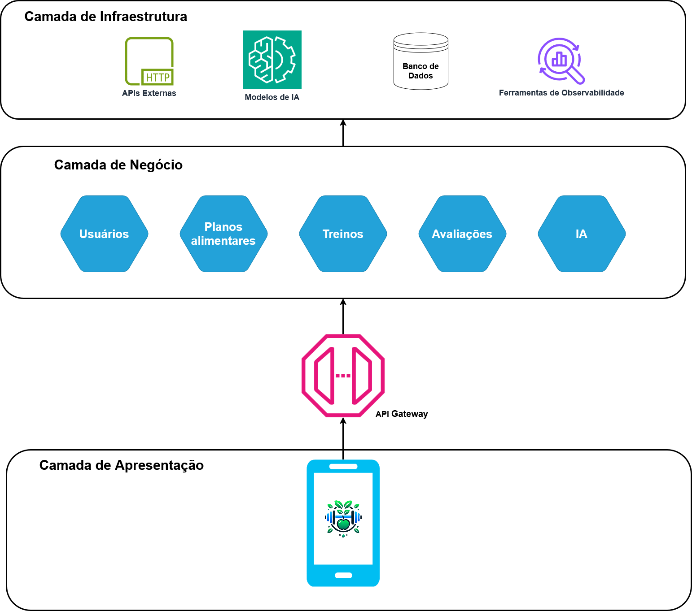
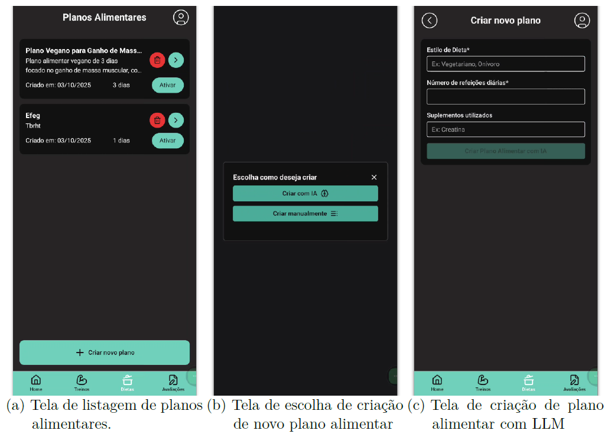
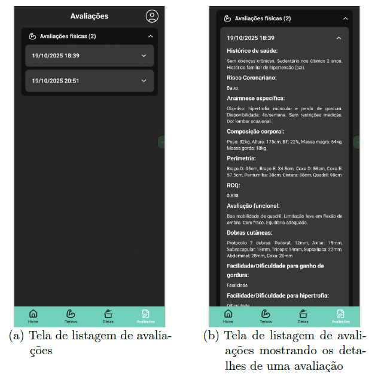

# Sistema de Geração de Recomendações de Treinos e Dicas Alimentares com uso de Inteligência Artificial

Projeto de Formatura da Escola Politécnica da USP: Sistema de Geração de Recomendações de Treinos e Dicas Alimentares com uso de Inteligência Artificial.

## Resumo

O projeto apresenta o desenvolvimento de um sistema colaborativo capaz de gerar recomendações personalizadas de treinos e planos alimentares com apoio de inteligência artificial. A solução foi pensada para aproximar nutricionistas e personal trainers de seus clientes, oferecendo um ambiente unificado em que é possível acompanhar treinos, alimentação e progresso físico de forma integrada. Além do aplicativo mobile, voltado ao usuário final, o trabalho inclui a concepção de uma arquitetura modular e escalável baseada em microsserviços, responsável por orquestrar informações de usuários, treinos, planos alimentares, avaliações e dados gerados pela Inteligência Artificial.

## Contexto e Motivação

O ponto de partida do projeto é o cenário de saúde da população brasileira, marcado por altos índices de sedentarismo, sobrepeso e doenças crônicas como hipertensão e diabetes. Na Pesquida Nacional de Saúde realizada em 2019, constatou-se que 40,3% da população adulta foi enquadrada como insuficientemente ativa, 23,9% da população dessa faixa etária recebeu o diagnóstico de hipertensão arterial e 7,7% foram diagnosticadas com diabetes.

Com isso, conclue-se que muitas pessoas têm dificuldade em manter uma rotina de exercícios e alimentação equilibrada, seja pela falta de orientação especializada, seja pelo custo de acompanhamento individualizado com profissionais como nutricionistas e personal trainers.Além disso, as soluções disponíveis no mercado tendem a tratar treino e nutrição de forma separada, obrigando o usuário a alternar entre diferentes aplicativos e dificultando uma visão integrada do próprio progresso.

## Objetivos

O objetivo central do trabalho é desenvolver um protótipo de produto digital para o segmento fitness que ofereça acompanhamento personalizado aos usuários finais, combinando a colaboração de profissionais da saúde com a geração automática de recomendações por meio de inteligência artificial generativa. A plataforma busca centralizar, em um único sistema, a criação e o acompanhamento de treinos, planos alimentares e avaliações, facilitando o monitoramento do progresso individual e a construção de um plano mais completo e coerente ao longo do tempo.

Especificamente, pode-se elencar os seguintes objetivos do projeto:

- Definir uma arquitetura de software modular, segura e escalável;
- Modelar o sistema de modo a criar um ambiente colaborativo entre profissionais da área de saúde e seus clientes;
- Integrar na solução o uso de IA generativa, sendo capaz de gerar planos de treino e alimentação personalizados a partir dos dados cadastrados no sistema.

## Desenvolvimento

O desenvolvimento do projeto foi conduzido a partir do seguinte processo:

1. Estudo bibliográfico sobre atividade física, nutrição, inteligência artificial generativa e príncipios de desenvolvimento de software;
2. Realização de entrevistas com profissionais da saúde para levantar informações relevantes sobre a área de estudo e requisitos de uso para a plataforma;
3. Especificação de requisitos funcionais e arquitetura;
4. Implementação e validação do sistema.

Do ponto de vista técnico, a solução foi construída adotando o padrão em camadas para a visão de alto nível do projeto; o padrão de microsserviços para a organização dos módulos definidos para o problema; e a arquitetura limpa para orientar o processo de desenvolvimento de software de cada microsserviço. A visão geral sobre a arquitetura do projeto pode ser encontrada a seguir:

<figure>
  <h4 style="text-align: center">Visão Geral da Arquitetura.</h4>
    
  <figcaption style="text-align: center">Fonte: Produzido pelos autores.</figcaption>
</figure>

O aplicativo mobile foi desenvolvido em React Native com Expo Go, garantindo compatibilidade com múltiplas plataformas mobile. No backend, foram utilizados Node.js e o framework Fastify para estruturar os microsserviços, responsáveis por usuários, planos alimentares, treinos, avaliações e IA, em conjunto com bancos de dados adequados a cada módulo, utlizando MongoDB ou Postgres nas aplicações. O módulo de IA foi implementado com o framework LangChain, empregando técnicas de RAG para especificar as informações referentes do cliente final para o modelo de LLM na geração de planos e treinos personalizados.

## Resultados

Como resultado, foi entregue um protótipo funcional do aplicativo para o perfil de cliente, permitindo ao usuário se cadastrar, acessar uma tela inicial que resume seu plano alimentar do dia e seu progresso, visualizar seus treinos, consultar planos alimentares detalhados, acompanhar o registro das refeições e conferir avaliações físicas e nutricionais realizadas por profissionais. A solução já é capaz de gerar treinos e planos alimentares personalizados com o auxílio da IA, a partir de dados de anamnese e informações armazenadas nos microsserviços, demonstrando na prática a viabilidade da abordagem proposta. Seguem algumas imagens de cada seção do aplicativo desenvolvido:

<figure>
  <h4 style="text-align: center">Telas da seção home e menu.</h4>
  
  <figcaption style="text-align: center">Fonte: Produzido pelos autores.</figcaption>
</figure>

<figure>
  <h4 style="text-align: center">Telas da seção de treinos.</h4>
  
  <figcaption style="text-align: center">Fonte: Produzido pelos autores.</figcaption>
</figure>

<figure>
  <h4 style="text-align: center">Telas da seção de dietas.</h4>
  
  <figcaption style="text-align: center">Fonte: Produzido pelos autores.</figcaption>
</figure>

<figure>
  <h4 style="text-align: center">Telas da seção de avaliações.</h4>
  
  <figcaption style="text-align: center">Fonte: Produzido pelos autores.</figcaption>
</figure>

Do ponto de vista de engenharia de software, o projeto comprovou a viabilidade de uma arquitetura modular, segura e escalável para integrar profissionais da saúde e clientes em um ambiente colaborativo, utilizando modelos generativos com recuperação de contexto. No estágio atual, as funcionalidades voltadas ao cliente estão implementadas e integradas ao backend, enquanto as interfaces completas para nutricionistas e personal trainers são apontadas como evolução natural do sistema em trabalhos futuros, mantendo a mesma base arquitetural.

## Autores

Integrantes:

- Arthur Salvador de Almeida
- Guilherme Castelo Branco de Brito
- Renato Naves Fleury

Orientador:

- Prof. Dr. Jorge Luís Risco Becerra - Departamento de Engenharia de Computação e Sistemas Digitais da Universidade de São Paulo (USP)
